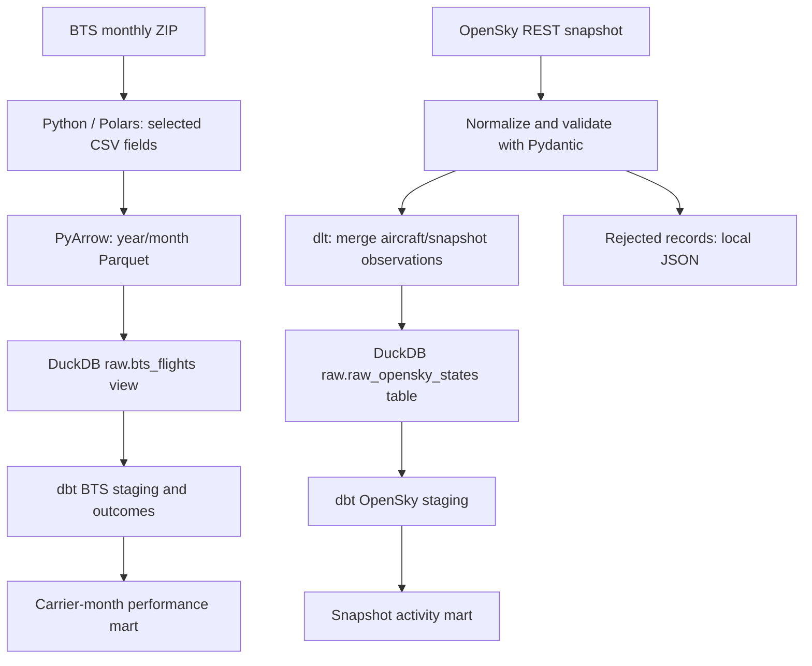

# Flight Analytics Lakehouse

A local Analytics Engineering project for two questions: how did reporting US airlines perform in a historical month, and what aircraft did OpenSky observe in a recent snapshot? Python ingests the sources, Parquet retains historical flight rows, and dbt builds tested SQL models in one DuckDB database.

BTS and OpenSky are separate datasets. BTS reports scheduled flight operations; OpenSky reports aircraft/transponder observations. A callsign is not a stable BTS flight identifier, and a transponder address identifies an aircraft rather than a scheduled flight. Neither source provides a defensible shared key here, so this project does not join them.

## Architecture



Both paths use `dbt build`, which runs models and their data tests together. dbt owns analytical definitions; Python inspection queries read the finished marts.

## Sources and grains

| Dataset | Source | Stored/model grain | Purpose |
| --- | --- | --- | --- |
| BTS | [Reporting Carrier On-Time Performance](https://www.transtats.bts.gov/Fields.asp?gnoyr_VQ=FGK), monthly PREZIP archive | One reported CSV row; staging ID is year/month/source-row ordinal | Historical arrival delays, cancellations and diversions |
| OpenSky | [State vectors REST API](https://openskynetwork.github.io/opensky-api/rest.html) | One `(snapshot_time, icao24)` observation | Observed airborne/ground activity and ground speed |

The default OpenSky bounding box covers the contiguous US: latitude 24.39–49.38, longitude -124.84–-66.88. `origin_country` is the aircraft registration country inferred from its ICAO address, not its departure country. Staging renames it to `registration_country`. Altitude is meters, velocity is meters/second, and modeled timestamps are displayed in UTC.

## Setup

Use **Python 3.12**. Run commands from the checkout root.

```bash
git clone https://github.com/Sonicollin/flight-analytics-lakehouse.git
cd flight-analytics-lakehouse
python -m venv .venv
source .venv/bin/activate
python -m pip install -c requirements.lock -e ".[dev]"
```

On Windows, activate with `.venv\Scripts\activate` in Command Prompt or `.venv\Scripts\Activate.ps1` in PowerShell.

`pyproject.toml` is the dependency and packaging definition. `requirements.lock` pins the tested Python 3.12 dependency resolution, including transitive dependencies; use it as a constraints file. It is a version snapshot, not a platform-specific, hash-verified lock. To update dependencies, update project pins in a clean environment, install, run the checks, and regenerate with `python -m pip freeze --exclude flight-analytics-lakehouse > requirements.lock`.

## Configuration

Defaults work without a `.env` file. Override these through environment variables or a root `.env` (ignored by Git). Relative overrides resolve from the calling working directory; defaults resolve from the checkout root.

| Variable | Default | Use |
| --- | --- | --- |
| `RAW_DATA_DIR` | `data/raw` | Downloaded BTS ZIP archives |
| `PROCESSED_DATA_DIR` | `data/processed/bts` | BTS-only Hive-partitioned Parquet root |
| `DUCKDB_PATH` | `data/lakehouse.duckdb` | Shared local warehouse |
| `DLT_PIPELINES_DIR` | `data/dlt` | dlt state and load packages |
| `REJECTED_DATA_DIR` | `data/rejected` | Invalid OpenSky records and validation errors |
| `DUCKDB_MEMORY_LIMIT` | `4GB` | dbt DuckDB query memory setting |
| `DUCKDB_THREADS` | `4` | dbt DuckDB threads |
| `OPENSKY_TOKEN` | unset | Optional OAuth2 bearer access token |

The CLI passes resolved database/settings values to dbt, so ingestion and transformation target the same warehouse. Memory settings apply to dbt queries, not the entire Python process or a hard operating-system memory limit.

OpenSky anonymous access worked during the verification run. Availability and rate limits can change. If access returns 401/403, obtain a token using the provider's [OAuth2 client credentials instructions](https://github.com/openskynetwork/opensky-api/blob/master/docs/free/rest.rst) and set `OPENSKY_TOKEN`. Token acquisition and refresh are outside this project; do not commit credentials. HTTP errors fail the command rather than silently substituting data.

## Execute

The canonical entry point is `main.py`. A normal run ingests both sources, registers raw sources, runs `dbt build`, and prints both marts:

```bash
python main.py run --year 2023 --month 1
```

Each source can also run independently. These commands build/test the models and inspect outputs after ingestion:

```bash
python main.py bts --year 2023 --month 1
python main.py opensky
python main.py build
python main.py inspect
```

`--force` redownloads the BTS ZIP. A cached archive is reused otherwise; conversion still replaces the selected month. Local source files allow reproducible runs without network access:

```bash
python main.py run --bts-archive /path/to/month.zip --opensky-json /path/to/states.json
```

`--year`/`--month` select the HTTP download; a supplied local archive's own fields determine its partition. The saved OpenSky JSON must have the original API envelope (`time` and `states`).

For an interview walkthrough without external APIs:

```bash
python main.py demo
```

This runs the real Parquet/dlt/dbt workflow with clearly labeled **synthetic fixtures**, isolated in `data/demo`. It never inserts demo observations into the default warehouse. To inspect that database in a separate process, set `DUCKDB_PATH=data/demo/lakehouse.duckdb` before `python main.py inspect`.

Absent sources are initialized with an empty schema. This permits BTS-only and OpenSky-only runs. Printed source counts distinguish empty/absent datasets; passing tests on an empty source does not prove that ingestion succeeded. A full run fails if either requested ingestion fails. Ingested data remains available for a later `python main.py build`.

## dbt modeling and metrics

| Model | Grain | Responsibility |
| --- | --- | --- |
| `stg_bts_flights` | BTS archive row | Names, types, partition fields, row lineage |
| `int_bts_flight_outcomes` | Same BTS row | Explicit arrival eligibility and nullable delay outcome |
| `mart_bts_carrier_monthly` | Year/month/carrier | Counts, observed delay means, delay/cancellation percentages, within-month arrival-delay rank |
| `stg_opensky_states` | Aircraft/snapshot | UTC timestamps, cleaned identifiers and documented units |
| `mart_opensky_snapshot_activity` | Snapshot time | Observed aircraft, airborne/ground counts, position availability and airborne ground-speed mean |

An arrival is delayed at **15 minutes or more**, following the [BTS definition](https://www.transtats.bts.gov/ot_delay/). Arrival-delay means and rates use non-cancelled, non-diverted flights with a measured arrival delay. Unknown delays remain unknown. Departure means use non-cancelled flights with measured departure delay. Cancellation rates use all reported rows. Sample counts accompany the means/rates, and rates with no eligible arrivals are null.

Arrival-delay rank orders the average observed arrival delay within each month. It is descriptive, not a route-mix-adjusted measure of airline quality. Negative delays mean early arrivals/departures. OpenSky counts describe sensor observations, not complete scheduled flight traffic; summing aircraft across snapshots would count repeat observations.

Schema tests cover identity uniqueness, required fields, valid months/flags and real lineage relationships. SQL data tests check date consistency, metric bounds, coordinate/identifier validity and reconciliation of snapshot counts. No dbt package or Python model is needed for these transformations.

## Inspect analytical outputs

`python main.py inspect` prints the two marts. You can also connect directly to DuckDB:

```python
import duckdb
with duckdb.connect("data/lakehouse.duckdb", read_only=True) as con:
    con.execute("SET TimeZone = 'UTC'")
    print(con.sql("""
        select year, month, carrier, eligible_arrivals,
               avg_arr_delay, arrival_delay_rate_pct, cancellation_rate_pct
        from mart_bts_carrier_monthly
        order by year, month, arrival_delay_rank
    """).fetchall())
    print(con.sql("select * from mart_opensky_snapshot_activity").fetchall())
```

Additional example queries live in `dbt_project/analyses/example_queries.sql`. To generate dbt documentation after a build, use `dbt docs generate --project-dir dbt_project --profiles-dir dbt_project` from the root, then `dbt docs serve` with the same directories. When using path overrides, export `DUCKDB_PATH` for direct dbt commands; `.env` loading is provided by the Python CLI, not dbt itself.

Example **synthetic** demo result:

| Carrier | Reported flights | Eligible arrivals | Mean arrival delay (min) | Arrival delay rate | Cancellation rate |
| --- | ---: | ---: | ---: | ---: | ---: |
| DL | 2 | 2 | 1.0 | 0% | 0% |
| AA | 5 | 2 | 2.5 | 50% | 20% |

The demo's OpenSky snapshot contains two aircraft: one airborne, one on the ground, and one with a known position.

## Testing

```bash
python -m pytest -q
python main.py demo
```

Pytest uses temporary data/database/dlt paths. It preserves HTTP download and normalization tests, Pydantic boundary tests and partition tests, and exercises actual dlt loading and actual `dbt build` in the integration tests. Integration assertions check the 15-minute threshold, missing-delay denominators, cancellations/diversions, same-snapshot merge behavior, monthly replacement, and analytical outputs. It also covers interrupted downloads, malformed API responses, rejected-record retention and empty-source initialization. Tests require installed dbt dependencies, but no network or secrets.

The GitHub Actions workflow runs the same offline pytest suite on Python 3.12. The live sources are intentionally outside CI because responses, credentials, and availability change. See [verification.md](docs/verification.md) for the recorded live/offline results and limitations.

## Repository structure

| Path | Contents |
| --- | --- |
| `main.py` | One orchestration/inspection CLI |
| `src/config.py` | Environment settings and paths |
| `src/ingestion.py`, `src/contracts.py` | HTTP download, OpenSky normalization/contract and dlt load |
| `src/storage.py` | BTS CSV conversion and monthly Parquet replacement |
| `src/warehouse.py`, `src/analytics.py` | Raw source registration and modeled-output readers |
| `src/demo.py` | Isolated synthetic walkthrough |
| `dbt_project/` | Portable profile, staging/outcome/mart SQL, tests and example queries |
| `tests/` | Unit/integration tests and small synthetic source fixtures |
| `docs/` | Verification evidence and final portfolio review |
| `data/` | Ignored downloads, Parquet, database, dlt state, rejects and demo outputs |

## Design decisions and limitations

Monthly BTS processing is **eager**: the decompressed CSV bytes and selected Polars columns are materialized in memory. HTTP ZIP download is streamed to disk; CSV conversion is not out-of-core. Processing one month at a time is a deliberate, simple choice. PyArrow writes compressed columnar files; DuckDB reads them directly. This project makes no end-to-end zero-copy or memory-bound guarantee.

BTS reruns replace a month's files after writing a staged replacement. The row ordinal provides source-row lineage only; it is not a stable business flight key across revised archives. Replacement assumes a single writer and is not crash-atomic across both filesystem renames. OpenSky merge uses `(snapshot_time, icao24)` so repeated snapshots do not add duplicate observations, while later snapshots retain aircraft history. An empty snapshot creates no activity-mart row, and invalid records are retained locally for investigation; rejected observations are excluded from activity counts.

Malformed payload structure fails the ingestion; individual contract failures are quarantined, and an all-invalid batch fails. There is no scheduler, retry/backoff policy, incremental BTS loading, retention policy, complete flight tracking, cloud deployment or multi-writer support. DuckDB is suitable for this local workflow; keep concurrent writers closed and run CLI/test/dbt builds sequentially because generated dbt directories are shared. Changing to distributed infrastructure would require a new operational design rather than a claim that this implementation already supports it.

Existing Parquet from the earlier version lacks the required outcome/lineage columns. Regenerate it from cached ZIPs using `bts`; do not mix old Parquet into the configured BTS-only root. Earlier OpenSky tables in `main` are not migrated; this version lands in `raw` in the new default database path.
